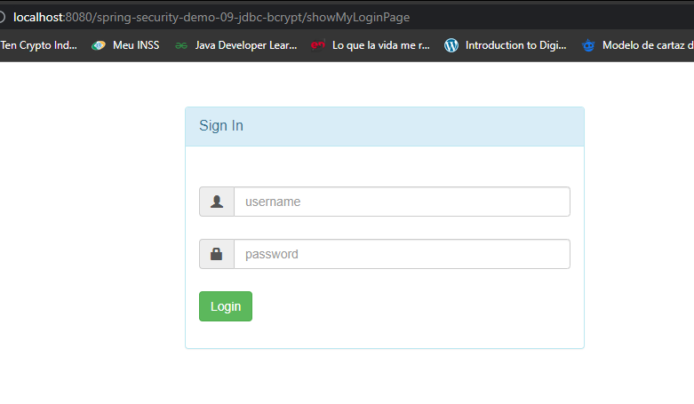
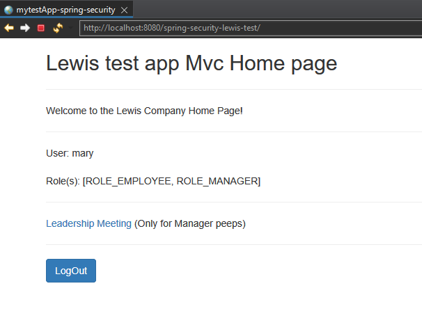
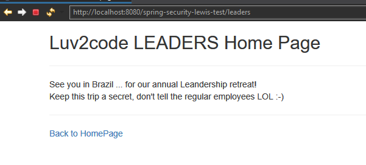
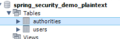

# JAVA SPRING Security and JDBC

=

## 🖼 Screenshot application screen  

Login Screen

 
 

Home Page 

 
 

Page Authorized by (specific user)

 
 

Database Tables

 
 
 

 
## 🚀 Tech Used 
 

- SPRING Security 
- MYSQL  
- html e css  
- JDBC 
- AOP Logger  
- Bootstrap
 

## Linkedin below

<h4 align="center">
   Created by   <a href="https://www.linkedin.com/in/luiz-carlos-b50693173/" target="_blank"> Luiz Carlos </a>
</h4>

</html>
